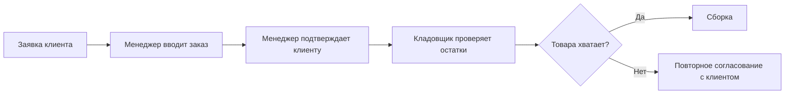
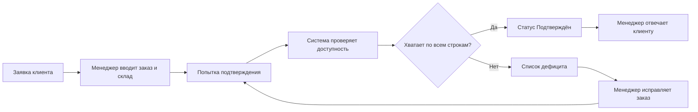

# Схема процесса

## Как есть

```mermaid
flowchart LR
  A[Заявка клиента] --> B[Менеджер вводит заказ]
  B --> C[Менеджер подтверждает клиенту]
  C --> D[Кладовщик проверяет остатки]
  D --> E{Товара хватает?}
  E -- Да --> F[Сборка]
  E -- Нет --> G[Повторное согласование с клиентом]
```

## Как будет

```mermaid
flowchart LR
  A[Заявка клиента] --> B[Менеджер вводит заказ и склад]
  B --> C[Попытка подтверждения]
  C --> D[Система проверяет доступность]
  D --> E{Хватает по всем строкам?}
  E -- Да --> F[Статус Подтверждён]
  F --> G[Менеджер отвечает клиенту]
  E -- Нет --> H[Список дефицита]
  H --> I[Менеджер исправляет заказ]
  I --> C
```

**Точка контроля:** переход заказа в статус «Подтверждён». Сообщение клиенту происходит после успешного перехода.
